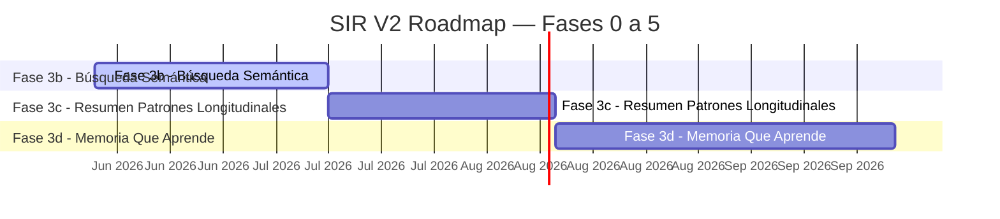

# SIR V2 — Master Plan (Life OS)

## Estado general

Última actualización: `2026-05-28T19:10:42Z`  
Generado automáticamente por `.github/workflows/sync-roadmap.yml`

**Fase activa:** Fase 3b - Búsqueda Semántica — Embeddings + pgvector para busqueda por significado  
**Hash del último commit humano:** `8c99d4c`

> 📋 Para backlog de próximas sesiones, ideas brainstorm y descartados, ver [docs/BACKLOG.md](docs/BACKLOG.md).

> SIR V2 es un Life Operating System que evoluciona en capas progresivas.
> Activo central: Human Contextual Memory Graph acumulado durante años.

---

## Progreso general

```
████████████████████████████████████████ 42/42 issues cerrados (100%)
```

✅ Cerrados: 42 | 🔄 En progreso: 0 | ⬜ Pendientes: 0 | 🚨 Bloqueantes: 0

---

## Timeline visual



**Estado por fase:**

| Fase | Período | Estado | Progreso |
|------|---------|--------|----------|
| Fase 0 - Fundamentos | Setup | ✅ Completado | ░░░░░░░░░░ 0% |
| Fase 1 - Stores y dominio | Dominio inicial | ✅ Completado | ██████████ 100% |
| Fase 2 - Context Engine | Estado vivo | ✅ Completado | ██████████ 100% |
| Fase Backend & Sync | Persistencia remota | ✅ Completado | ██████████ 100% |
| Fase 4 - UI Produccion | UI usuario | ✅ Completado | ██████████ 100% |
| Fase 3a - Historial Profundo | Exploracion temporal | ✅ Completado | ██████████ 100% |
| Fase 3b - Búsqueda Semántica | Jun–Jul 2026 | 🔄 Activo | ░░░░░░░░░░ 0% |
| Fase 3c - Resumen Patrones Longitudinales | Jul–Ago 2026 | ⬜ Pendiente | ░░░░░░░░░░ 0% |
| Fase 3d - Memoria Que Aprende | Ago–Sep 2026 | ⬜ Pendiente | ░░░░░░░░░░ 0% |
| Fase 5 - IA Basica | Capa cognitiva | ⬜ Pendiente | ░░░░░░░░░░ 0% |

---

## Progreso por Fase

### Fase 0 - Fundamentos

**Período:** Setup  
**Due date:** —  
**Wedge:** Setup repo, Zustand stores, tipos base  
**Gate de salida:** Stack reproducible: Next.js + Zustand + Tailwind builds limpios

_(Fase cerrada — sin issues registrados)_

### Fase 1 - Stores y dominio

**Período:** Dominio inicial  
**Due date:** —  
**Wedge:** Self, Finance, Goals, Signals, Relationships, Memory  
**Gate de salida:** Stores persistidos y rutas dedicadas operativas

```
████████████████████████████████████████ 1/1 issues cerrados (100%)
```

| # | Issue | Labels | Estado | Cerrado |
|---|-------|--------|--------|---------|
| #8 | [[R4] Memory System base](https://github.com/aaronhuaynate66/sir-v2-life-os/issues/8) | fase-1, retroactive | ✅ Cerrado | 2026-05-25 |

### Fase 2 - Context Engine

**Período:** Estado vivo  
**Due date:** —  
**Wedge:** RichContextSnapshot, hook, panel, persistencia historica  
**Gate de salida:** Snapshot agregado + history persistido + cero hydration warnings

```
████████████████████████████████████████ 17/17 issues cerrados (100%)
```

| # | Issue | Labels | Estado | Cerrado |
|---|-------|--------|--------|---------|
| #9 | [[R5.1A] RichContextSnapshot types](https://github.com/aaronhuaynate66/sir-v2-life-os/issues/9) | fase-2, retroactive | ✅ Cerrado | 2026-05-25 |
| #10 | [[R5.1B] buildRichContextSnapshot builder](https://github.com/aaronhuaynate66/sir-v2-life-os/issues/10) | fase-2, retroactive | ✅ Cerrado | 2026-05-25 |
| #11 | [[R5.1C] Estabilizar useRichContext hook](https://github.com/aaronhuaynate66/sir-v2-life-os/issues/11) | fase-2, retroactive | ✅ Cerrado | 2026-05-25 |
| #12 | [Housekeeping pnpm lockfile + approve builds](https://github.com/aaronhuaynate66/sir-v2-life-os/issues/12) | deuda-tecnica, fase-2, retroactive | ✅ Cerrado | 2026-05-25 |
| #13 | [[R5.1D] RichContextDebugPanel integrado en /dashboard](https://github.com/aaronhuaynate66/sir-v2-life-os/issues/13) | fase-2, retroactive | ✅ Cerrado | 2026-05-25 |
| #14 | [Fix hydration: balance dashboard con locale en-US](https://github.com/aaronhuaynate66/sir-v2-life-os/issues/14) | fase-2, retroactive | ✅ Cerrado | 2026-05-25 |
| #15 | [Fix hydration: RichContextDebugPanel client-only](https://github.com/aaronhuaynate66/sir-v2-life-os/issues/15) | fase-2, retroactive | ✅ Cerrado | 2026-05-25 |
| #16 | [[R5.1E] Validacion runtime end-to-end](https://github.com/aaronhuaynate66/sir-v2-life-os/issues/16) | fase-2, retroactive | ✅ Cerrado | 2026-05-25 |
| #17 | [[R5.1F] Fix relational.activeAlerts + reloj client-only](https://github.com/aaronhuaynate66/sir-v2-life-os/issues/17) | fase-2, retroactive | ✅ Cerrado | 2026-05-25 |
| #18 | [[Sesion 6] Context Snapshot History](https://github.com/aaronhuaynate66/sir-v2-life-os/issues/18) | fase-2, retroactive | ✅ Cerrado | 2026-05-25 |
| #19 | [Bug UX: form financiero del dashboard tiene min=0 (impide gastos negativos)](https://github.com/aaronhuaynate66/sir-v2-life-os/issues/19) | deuda-tecnica, fase-2 | ✅ Cerrado | 2026-05-25 |
| #20 | [memory.totalMemories no aumenta con mutaciones desde /dashboard](https://github.com/aaronhuaynate66/sir-v2-life-os/issues/20) | deuda-tecnica, fase-2 | ✅ Cerrado | 2026-05-25 |
| #21 | [signals.topSignalIds no ordena por importancia](https://github.com/aaronhuaynate66/sir-v2-life-os/issues/21) | deuda-tecnica, fase-2 | ✅ Cerrado | 2026-05-25 |
| #25 | [Snapshot: trigger 'initial' para captura baseline (no 'manual')](https://github.com/aaronhuaynate66/sir-v2-life-os/issues/25) | deuda-tecnica, fase-2 | ✅ Cerrado | 2026-05-25 |
| #26 | [Snapshot: peaceMode tipado como string generico (perdio type safety)](https://github.com/aaronhuaynate66/sir-v2-life-os/issues/26) | deuda-tecnica, fase-2 | ✅ Cerrado | 2026-05-25 |
| #27 | [Snapshot: dedup de duplicados triviales en addSnapshot](https://github.com/aaronhuaynate66/sir-v2-life-os/issues/27) | deuda-tecnica, fase-2 | ✅ Cerrado | 2026-05-25 |
| #28 | [Snapshot: documentar scope debug-only del RichContextDebugPanel](https://github.com/aaronhuaynate66/sir-v2-life-os/issues/28) | deuda-tecnica, fase-2 | ✅ Cerrado | 2026-05-25 |

### Fase Backend & Sync

**Período:** Persistencia remota  
**Due date:** —  
**Wedge:** Migracion a Supabase con auth y sync multi-device  
**Gate de salida:** Schema + auth + sync engine + migracion localStorage + currency multi-moneda

```
████████████████████████████████████████ 6/6 issues cerrados (100%)
```

| # | Issue | Labels | Estado | Cerrado |
|---|-------|--------|--------|---------|
| #62 | [Session 20a: Supabase setup + initial schema](https://github.com/aaronhuaynate66/sir-v2-life-os/issues/62) | fase-backend-sync, retroactive | ✅ Cerrado | 2026-05-28 |
| #63 | [Session 20b: Auth flow (Google OAuth + Magic Link)](https://github.com/aaronhuaynate66/sir-v2-life-os/issues/63) | fase-backend-sync, retroactive | ✅ Cerrado | 2026-05-28 |
| #64 | [Session 21: UX polish (toasts + AlertDialogs + validaciones)](https://github.com/aaronhuaynate66/sir-v2-life-os/issues/64) | fase-backend-sync, retroactive | ✅ Cerrado | 2026-05-28 |
| #65 | [Session 20c: Data layer migration to Supabase](https://github.com/aaronhuaynate66/sir-v2-life-os/issues/65) | fase-backend-sync, retroactive | ✅ Cerrado | 2026-05-28 |
| #66 | [Session 20d: One-shot localStorage to Supabase migration](https://github.com/aaronhuaynate66/sir-v2-life-os/issues/66) | fase-backend-sync, retroactive | ✅ Cerrado | 2026-05-28 |
| #67 | [Session Currency: PEN default + USD with live exchange rate](https://github.com/aaronhuaynate66/sir-v2-life-os/issues/67) | fase-backend-sync, retroactive | ✅ Cerrado | 2026-05-28 |

### Fase 4 - UI Produccion

**Período:** UI usuario  
**Due date:** —  
**Wedge:** Reemplazar debug panel con UI real para el usuario final  
**Gate de salida:** Onboarding + uso diario sin necesidad de leer codigo

```
████████████████████████████████████████ 9/9 issues cerrados (100%)
```

| # | Issue | Labels | Estado | Cerrado |
|---|-------|--------|--------|---------|
| #53 | [Session 11: Fix Zustand persist hydration delay](https://github.com/aaronhuaynate66/sir-v2-life-os/issues/53) | fase-4, retroactive | ✅ Cerrado | 2026-05-28 |
| #54 | [Session 12: useHasHydrated + RouteSkeleton on all routes](https://github.com/aaronhuaynate66/sir-v2-life-os/issues/54) | fase-4, retroactive | ✅ Cerrado | 2026-05-28 |
| #55 | [Session 13: Design System base (shadcn/ui + Geist)](https://github.com/aaronhuaynate66/sir-v2-life-os/issues/55) | fase-4, retroactive | ✅ Cerrado | 2026-05-28 |
| #56 | [Session 14: Dashboard redesign with shadcn/ui](https://github.com/aaronhuaynate66/sir-v2-life-os/issues/56) | fase-4, retroactive | ✅ Cerrado | 2026-05-28 |
| #57 | [Session 15: Migrate 6 remaining routes to shadcn/ui](https://github.com/aaronhuaynate66/sir-v2-life-os/issues/57) | fase-4, retroactive | ✅ Cerrado | 2026-05-28 |
| #58 | [Session 16: Coral accent + unified navigation + modern Nav](https://github.com/aaronhuaynate66/sir-v2-life-os/issues/58) | fase-4, retroactive | ✅ Cerrado | 2026-05-28 |
| #59 | [Session 17: Dashboard re-imagined with visual hierarchy](https://github.com/aaronhuaynate66/sir-v2-life-os/issues/59) | fase-4, retroactive | ✅ Cerrado | 2026-05-28 |
| #60 | [Session 18: Propagate visual language to 6 domain routes](https://github.com/aaronhuaynate66/sir-v2-life-os/issues/60) | fase-4, retroactive | ✅ Cerrado | 2026-05-28 |
| #61 | [Session 19: Mobile responsiveness (critical fix)](https://github.com/aaronhuaynate66/sir-v2-life-os/issues/61) | fase-4, retroactive | ✅ Cerrado | 2026-05-28 |

### Fase 3a - Historial Profundo

**Período:** Exploracion temporal  
**Due date:** 2026-06-11  
**Wedge:** Navegacion temporal del historial existente con filtros y vistas longitudinales  
**Gate de salida:** Usuario puede explorar N meses atras con UI nativa (sin IA, sin embeddings)

```
████████████████████████████████████████ 4/4 issues cerrados (100%)
```

| # | Issue | Labels | Estado | Cerrado |
|---|-------|--------|--------|---------|
| #69 | [Fase 3a #1 — Analisis y diseno UI exploracion temporal](https://github.com/aaronhuaynate66/sir-v2-life-os/issues/69) | fase-3a | ✅ Cerrado | 2026-05-28 |
| #70 | [Fase 3a #2 — Implementar vista timeline con filtros](https://github.com/aaronhuaynate66/sir-v2-life-os/issues/70) | fase-3a | ✅ Cerrado | 2026-05-28 |
| #71 | [Fase 3a #3 — Conectar timeline con datos reales de Supabase](https://github.com/aaronhuaynate66/sir-v2-life-os/issues/71) | fase-3a | ✅ Cerrado | 2026-05-28 |
| #72 | [Fase 3a #4 — Gate de validacion Fase 3a](https://github.com/aaronhuaynate66/sir-v2-life-os/issues/72) | fase-3a | ✅ Cerrado | 2026-05-28 |

### Fase 3b - Búsqueda Semántica (activa)

**Período:** Significado, no keywords  
**Due date:** 2026-07-12  
**Wedge:** Embeddings + pgvector para busqueda por significado  
**Gate de salida:** Usuario puede preguntar 'que paso cuando me sentia ansioso por trabajo' y obtener resultados

_(Sin issues asignados aún. Arranca esta fase.)_

### Fase 3c - Resumen Patrones Longitudinales

**Período:** Insights automaticos  
**Due date:** 2026-08-11  
**Wedge:** LLM analiza historial y genera insights longitudinales automaticos  
**Gate de salida:** SIR genera 1 resumen semanal accionable con patrones observados

_(Sin issues asignados. Arranca cuando la fase previa cierre gate.)_

### Fase 3d - Memoria Que Aprende

**Período:** RAG cross-session  
**Due date:** 2026-09-25  
**Wedge:** Arquitectura de memoria persistente (short/medium/long term) con RAG  
**Gate de salida:** Cada interaccion con SIR tiene contexto profundo automatico del usuario

_(Sin issues asignados. Arranca cuando la fase previa cierre gate.)_

### Fase 5 - IA Basica

**Período:** Capa cognitiva  
**Due date:** —  
**Wedge:** Resumenes, sugerencias, briefings sobre el snapshot  
**Gate de salida:** Briefings diarios utiles + ≥1 sugerencia accionable por dia

_(Sin issues asignados. Arranca cuando la fase previa cierre gate.)_

---

## Bloqueantes y deuda transversal (sin milestone)

Estos issues no pertenecen a una fase especifica. Suelen ser deuda tecnica transversal o bloqueantes que cruzan fases.

| # | Issue | Labels | Estado |
|---|-------|--------|--------|
| #22 | [Line endings LF<->CRLF entre Windows local y CI Linux](https://github.com/aaronhuaynate66/sir-v2-life-os/issues/22) | deuda-tecnica | ✅ Cerrado |
| #23 | [pnpm-workspace.yaml benigno pero no es monorepo activo](https://github.com/aaronhuaynate66/sir-v2-life-os/issues/23) | deuda-tecnica | ✅ Cerrado |
| #30 | [Race condition: sync-roadmap workflow falla en closing-en-cascada de issues](https://github.com/aaronhuaynate66/sir-v2-life-os/issues/30) | deuda-tecnica | ✅ Cerrado |
| #33 | [UI muestra valores stale al primer mount (Zustand persist hydration delay)](https://github.com/aaronhuaynate66/sir-v2-life-os/issues/33) | deuda-tecnica, fase-2 | ✅ Cerrado |
| #35 | [Security: actualizar Next.js a versión patched (CVE-2025-66478 + others)](https://github.com/aaronhuaynate66/sir-v2-life-os/issues/35) | bloqueante, deuda-tecnica | ✅ Cerrado |

---

## Issues por categoría

### Context Engine

- ✅ [#9](https://github.com/aaronhuaynate66/sir-v2-life-os/issues/9) [R5.1A] RichContextSnapshot types
- ✅ [#10](https://github.com/aaronhuaynate66/sir-v2-life-os/issues/10) [R5.1B] buildRichContextSnapshot builder
- ✅ [#11](https://github.com/aaronhuaynate66/sir-v2-life-os/issues/11) [R5.1C] Estabilizar useRichContext hook
- ✅ [#12](https://github.com/aaronhuaynate66/sir-v2-life-os/issues/12) Housekeeping pnpm lockfile + approve builds
- ✅ [#13](https://github.com/aaronhuaynate66/sir-v2-life-os/issues/13) [R5.1D] RichContextDebugPanel integrado en /dashboard
- ✅ [#14](https://github.com/aaronhuaynate66/sir-v2-life-os/issues/14) Fix hydration: balance dashboard con locale en-US
- ✅ [#15](https://github.com/aaronhuaynate66/sir-v2-life-os/issues/15) Fix hydration: RichContextDebugPanel client-only
- ✅ [#16](https://github.com/aaronhuaynate66/sir-v2-life-os/issues/16) [R5.1E] Validacion runtime end-to-end
- ✅ [#17](https://github.com/aaronhuaynate66/sir-v2-life-os/issues/17) [R5.1F] Fix relational.activeAlerts + reloj client-only
- ✅ [#18](https://github.com/aaronhuaynate66/sir-v2-life-os/issues/18) [Sesion 6] Context Snapshot History
- ✅ [#19](https://github.com/aaronhuaynate66/sir-v2-life-os/issues/19) Bug UX: form financiero del dashboard tiene min=0 (impide gastos negativos)
- ✅ [#20](https://github.com/aaronhuaynate66/sir-v2-life-os/issues/20) memory.totalMemories no aumenta con mutaciones desde /dashboard
- ✅ [#21](https://github.com/aaronhuaynate66/sir-v2-life-os/issues/21) signals.topSignalIds no ordena por importancia
- ✅ [#25](https://github.com/aaronhuaynate66/sir-v2-life-os/issues/25) Snapshot: trigger 'initial' para captura baseline (no 'manual')
- ✅ [#26](https://github.com/aaronhuaynate66/sir-v2-life-os/issues/26) Snapshot: peaceMode tipado como string generico (perdio type safety)
- ✅ [#27](https://github.com/aaronhuaynate66/sir-v2-life-os/issues/27) Snapshot: dedup de duplicados triviales en addSnapshot
- ✅ [#28](https://github.com/aaronhuaynate66/sir-v2-life-os/issues/28) Snapshot: documentar scope debug-only del RichContextDebugPanel
- ✅ [#33](https://github.com/aaronhuaynate66/sir-v2-life-os/issues/33) UI muestra valores stale al primer mount (Zustand persist hydration delay)

### Backend & Sync

- ✅ [#62](https://github.com/aaronhuaynate66/sir-v2-life-os/issues/62) Session 20a: Supabase setup + initial schema
- ✅ [#63](https://github.com/aaronhuaynate66/sir-v2-life-os/issues/63) Session 20b: Auth flow (Google OAuth + Magic Link)
- ✅ [#64](https://github.com/aaronhuaynate66/sir-v2-life-os/issues/64) Session 21: UX polish (toasts + AlertDialogs + validaciones)
- ✅ [#65](https://github.com/aaronhuaynate66/sir-v2-life-os/issues/65) Session 20c: Data layer migration to Supabase
- ✅ [#66](https://github.com/aaronhuaynate66/sir-v2-life-os/issues/66) Session 20d: One-shot localStorage to Supabase migration
- ✅ [#67](https://github.com/aaronhuaynate66/sir-v2-life-os/issues/67) Session Currency: PEN default + USD with live exchange rate

### Memory Longitudinal (3a/b/c/d)

- ✅ [#69](https://github.com/aaronhuaynate66/sir-v2-life-os/issues/69) Fase 3a #1 — Analisis y diseno UI exploracion temporal
- ✅ [#70](https://github.com/aaronhuaynate66/sir-v2-life-os/issues/70) Fase 3a #2 — Implementar vista timeline con filtros
- ✅ [#71](https://github.com/aaronhuaynate66/sir-v2-life-os/issues/71) Fase 3a #3 — Conectar timeline con datos reales de Supabase
- ✅ [#72](https://github.com/aaronhuaynate66/sir-v2-life-os/issues/72) Fase 3a #4 — Gate de validacion Fase 3a

### UI Producción

- ✅ [#53](https://github.com/aaronhuaynate66/sir-v2-life-os/issues/53) Session 11: Fix Zustand persist hydration delay
- ✅ [#54](https://github.com/aaronhuaynate66/sir-v2-life-os/issues/54) Session 12: useHasHydrated + RouteSkeleton on all routes
- ✅ [#55](https://github.com/aaronhuaynate66/sir-v2-life-os/issues/55) Session 13: Design System base (shadcn/ui + Geist)
- ✅ [#56](https://github.com/aaronhuaynate66/sir-v2-life-os/issues/56) Session 14: Dashboard redesign with shadcn/ui
- ✅ [#57](https://github.com/aaronhuaynate66/sir-v2-life-os/issues/57) Session 15: Migrate 6 remaining routes to shadcn/ui
- ✅ [#58](https://github.com/aaronhuaynate66/sir-v2-life-os/issues/58) Session 16: Coral accent + unified navigation + modern Nav
- ✅ [#59](https://github.com/aaronhuaynate66/sir-v2-life-os/issues/59) Session 17: Dashboard re-imagined with visual hierarchy
- ✅ [#60](https://github.com/aaronhuaynate66/sir-v2-life-os/issues/60) Session 18: Propagate visual language to 6 domain routes
- ✅ [#61](https://github.com/aaronhuaynate66/sir-v2-life-os/issues/61) Session 19: Mobile responsiveness (critical fix)

### IA & Cognición

_(sin issues en esta categoría)_

### Dominio (stores)

- ✅ [#8](https://github.com/aaronhuaynate66/sir-v2-life-os/issues/8) [R4] Memory System base

### Fundamentos & Infra

_(sin issues en esta categoría)_

### Deuda Técnica

- ✅ [#22](https://github.com/aaronhuaynate66/sir-v2-life-os/issues/22) Line endings LF<->CRLF entre Windows local y CI Linux
- ✅ [#23](https://github.com/aaronhuaynate66/sir-v2-life-os/issues/23) pnpm-workspace.yaml benigno pero no es monorepo activo
- ✅ [#30](https://github.com/aaronhuaynate66/sir-v2-life-os/issues/30) Race condition: sync-roadmap workflow falla en closing-en-cascada de issues
- ✅ [#35](https://github.com/aaronhuaynate66/sir-v2-life-os/issues/35) Security: actualizar Next.js a versión patched (CVE-2025-66478 + others)

---

## Decisiones arquitectónicas (ADRs)

| # | Decisión | Estado | Fecha |
|---|----------|--------|-------|
| 0001 | [Zustand como gestor de estado global en SIR V2](docs/decisions/0001-zustand-state-management.md) | Accepted | 2026-05-20 |
| 0002 | [RichContextSnapshot: agregador centralizado para consumir estado vivo](docs/decisions/0002-rich-context-snapshot.md) | Accepted | 2026-05-22 |
| 0003 | [RichContextDebugPanel renderizado client-only para evitar hydration mismatch](docs/decisions/0003-client-only-debug-panel.md) | Accepted | 2026-05-23 |
| 0004 | [Context Snapshot History: store separado y captura por eventos](docs/decisions/0004-context-snapshot-history.md) | Accepted | 2026-05-25 |
| 0005 | [Arquitectura del Timeline (Fase 3a) — multi-query paralela, estado en React, shape unificada](docs/decisions/0005-timeline-architecture.md) | Proposed | 2026-05-28 |

Auto-generado leyendo `docs/decisions/`.

---

## Tests runtime validados

Validación manual end-to-end del Context Engine (ver issue R5.1E):

| Test | Foco | Estado |
|------|------|--------|
| 1 | RichContextSnapshot se construye sin errores en mount | ✅ |
| 2 | useRichContext devuelve estructura completa y tipada | ✅ |
| 3 | Mutación en useFinanceStore actualiza snapshot reactivamente | ✅ |
| 4 | Locale en-US fija formato numérico (sin hydration mismatch) | ✅ |
| 5 | Goals: completar/cancelar refleja en snapshot | ✅ |
| 6 | Relationships: agregar persona refleja peopleCount | ✅ |
| 7 | Memory: addMemory aumenta totalMemories | ✅ |
| 8 | useSnapshotStore captura por eventos sin duplicados | ✅ |

---

## Commits recientes

Últimos 10 commits del repo (excluyendo bot y GitHub Actions):

| Hash | Autor | Mensaje | Fecha |
|------|-------|---------|-------|
| `8c99d4c` | aaronhuaynate66 | fix(sweep): form defaults + RelationalScore copy + Sheet a11y + BACKLOG sync (post-Sesion 3) | 2026-05-30 |
| `e043611` | aaronhuaynate66 | feat(detail-page): RelationalScore + BirthdayCountdown + birth_date editable (Sesion 3 PR-B) | 2026-05-30 |
| `5094588` | aaronhuaynate66 | feat(detail-page): ruta /relaciones/[slug] + observations fetch layer + LastInteractionPanel (Sesion 3 PR-A) | 2026-05-30 |
| `93a95c6` | aaronhuaynate66 | fix(matcher+nav): close BUG-002 (bidirectional matcher) + BUG-003 (entry point) — Sesion 2.7 | 2026-05-30 |
| `3596687` | Aaron Huaynate | docs(backlog): add BUG-001/002/003 + sesiones 2.6/2.7 + futuros | 2026-05-29 |
| `c387694` | aaronhuaynate66 | feat(detail-page): foundation — observations table + capture universal pipeline (Sesion 1+2+2.5) | 2026-05-29 |
| `daee855` | aaronhuaynate66 | Captura WhatsApp con Claude Vision Sonnet (#85) | 2026-05-29 |
| `f5f05a3` | aaronhuaynate66 | docs(backlog): add document intelligence layer ideas (#84) | 2026-05-29 |
| `9f46673` | aaronhuaynate66 | Refactor: spanish URLs + person slugs + detail page (#83) | 2026-05-29 |
| `1d900e3` | aaronhuaynate66 | Timeline: consolidar capturas en una card agrupada (capture_id) (#82) | 2026-05-29 |

---

## Infraestructura

| Item | Estado | Notas |
|------|--------|-------|
| GitHub repo publico | ✅ Activo | https://github.com/aaronhuaynate66/sir-v2-life-os |
| GitHub Actions CI | ✅ Activo | validate.yml (type-check + lint + build) |
| Living Roadmap System | ✅ Activo | Auto-sync MASTER_PLAN.md en cada cambio de issue (sync-roadmap.yml) |
| Milestones por fase | ✅ Activo | Fase 0-5 como GitHub Milestones |
| ADRs en docs/decisions/ | ✅ Activo | MADR template, indice en README |
| Next.js 15 (App Router) | ✅ Activo | Stack base |
| Zustand + persist (localStorage) | ✅ Activo | Stores por dominio, ver ADR 0001 |
| Tailwind CSS + Framer Motion | ✅ Activo | Estilo + animaciones |
| Deploy en Vercel | ✅ Activo | Produccion en https://sir-v2-life-os.vercel.app |
| Backend / Supabase | ✅ Activo | Cerrado en Fase Backend & Sync (auth + sync + RLS) |

---

## Cómo se mantiene este documento

Auto-generado por `scripts/generate_roadmap.py` ejecutado por `.github/workflows/sync-roadmap.yml`.

**Triggers de regeneración:**

- Apertura, cierre, edición de un issue
- Cambio de labels o milestone en un issue
- Merge de un PR a `main`
- Cron diario a las 13:00 UTC (safety net)
- Disparo manual (`workflow_dispatch`)

**No editar manualmente este archivo.** Cualquier cambio será sobrescrito en la próxima ejecución del workflow. Para cambiar el contenido visible, actualiza los issues, milestones, ADRs o commits — la fuente de verdad son ellos.

---

_Generado por SIR V2 Living Roadmap System v0.1 (adaptado de sica-platform)_
