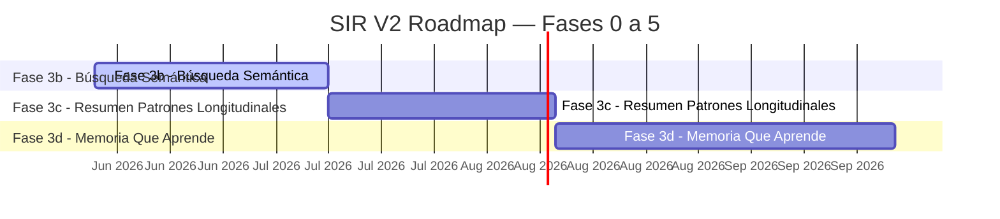

# SIR V2 — Master Plan (Life OS)

## Estado general

Última actualización: `2026-05-28T19:10:42Z`  
Generado automáticamente por `.github/workflows/sync-roadmap.yml`

**Fase activa:** Fase 3b - Búsqueda Semántica — Embeddings + pgvector para busqueda por significado  
**Hash del último commit humano:** `43521c1`

> 📋 El backlog vive embebido más abajo (sección "Backlog"). Fuente editable: [docs/BACKLOG.md](docs/BACKLOG.md). Cada regeneración del MASTER_PLAN re-embebe ese archivo verbatim.

> SIR V2 es un Life Operating System que evoluciona en capas progresivas.
> Activo central: Human Contextual Memory Graph acumulado durante años.

---

## Progreso general

```
████████████████████████████████████████ 42/42 issues cerrados (100%)
```

✅ Cerrados: 42 | 🔄 En progreso: 0 | ⬜ Pendientes: 0 | 🚨 Bloqueantes: 0

---

## Timeline visual



**Estado por fase:**

| Fase | Período | Estado | Progreso |
|------|---------|--------|----------|
| Fase 0 - Fundamentos | Setup | ✅ Completado | ░░░░░░░░░░ 0% |
| Fase 1 - Stores y dominio | Dominio inicial | ✅ Completado | ██████████ 100% |
| Fase 2 - Context Engine | Estado vivo | ✅ Completado | ██████████ 100% |
| Fase Backend & Sync | Persistencia remota | ✅ Completado | ██████████ 100% |
| Fase 4 - UI Produccion | UI usuario | ✅ Completado | ██████████ 100% |
| Fase 3a - Historial Profundo | Exploracion temporal | ✅ Completado | ██████████ 100% |
| Fase 3b - Búsqueda Semántica | Jun–Jul 2026 | 🔄 Activo | ░░░░░░░░░░ 0% |
| Fase 3c - Resumen Patrones Longitudinales | Jul–Ago 2026 | ⬜ Pendiente | ░░░░░░░░░░ 0% |
| Fase 3d - Memoria Que Aprende | Ago–Sep 2026 | ⬜ Pendiente | ░░░░░░░░░░ 0% |
| Fase 5 - IA Basica | Capa cognitiva | ⬜ Pendiente | ░░░░░░░░░░ 0% |

---

## Progreso por Fase

### Fase 0 - Fundamentos

**Período:** Setup  
**Due date:** —  
**Wedge:** Setup repo, Zustand stores, tipos base  
**Gate de salida:** Stack reproducible: Next.js + Zustand + Tailwind builds limpios

_(Fase cerrada — sin issues registrados)_

### Fase 1 - Stores y dominio

**Período:** Dominio inicial  
**Due date:** —  
**Wedge:** Self, Finance, Goals, Signals, Relationships, Memory  
**Gate de salida:** Stores persistidos y rutas dedicadas operativas

```
████████████████████████████████████████ 1/1 issues cerrados (100%)
```

| # | Issue | Labels | Estado | Cerrado |
|---|-------|--------|--------|---------|
| #8 | [[R4] Memory System base](https://github.com/aaronhuaynate66/sir-v2-life-os/issues/8) | fase-1, retroactive | ✅ Cerrado | 2026-05-25 |

### Fase 2 - Context Engine

**Período:** Estado vivo  
**Due date:** —  
**Wedge:** RichContextSnapshot, hook, panel, persistencia historica  
**Gate de salida:** Snapshot agregado + history persistido + cero hydration warnings

```
████████████████████████████████████████ 17/17 issues cerrados (100%)
```

| # | Issue | Labels | Estado | Cerrado |
|---|-------|--------|--------|---------|
| #9 | [[R5.1A] RichContextSnapshot types](https://github.com/aaronhuaynate66/sir-v2-life-os/issues/9) | fase-2, retroactive | ✅ Cerrado | 2026-05-25 |
| #10 | [[R5.1B] buildRichContextSnapshot builder](https://github.com/aaronhuaynate66/sir-v2-life-os/issues/10) | fase-2, retroactive | ✅ Cerrado | 2026-05-25 |
| #11 | [[R5.1C] Estabilizar useRichContext hook](https://github.com/aaronhuaynate66/sir-v2-life-os/issues/11) | fase-2, retroactive | ✅ Cerrado | 2026-05-25 |
| #12 | [Housekeeping pnpm lockfile + approve builds](https://github.com/aaronhuaynate66/sir-v2-life-os/issues/12) | deuda-tecnica, fase-2, retroactive | ✅ Cerrado | 2026-05-25 |
| #13 | [[R5.1D] RichContextDebugPanel integrado en /dashboard](https://github.com/aaronhuaynate66/sir-v2-life-os/issues/13) | fase-2, retroactive | ✅ Cerrado | 2026-05-25 |
| #14 | [Fix hydration: balance dashboard con locale en-US](https://github.com/aaronhuaynate66/sir-v2-life-os/issues/14) | fase-2, retroactive | ✅ Cerrado | 2026-05-25 |
| #15 | [Fix hydration: RichContextDebugPanel client-only](https://github.com/aaronhuaynate66/sir-v2-life-os/issues/15) | fase-2, retroactive | ✅ Cerrado | 2026-05-25 |
| #16 | [[R5.1E] Validacion runtime end-to-end](https://github.com/aaronhuaynate66/sir-v2-life-os/issues/16) | fase-2, retroactive | ✅ Cerrado | 2026-05-25 |
| #17 | [[R5.1F] Fix relational.activeAlerts + reloj client-only](https://github.com/aaronhuaynate66/sir-v2-life-os/issues/17) | fase-2, retroactive | ✅ Cerrado | 2026-05-25 |
| #18 | [[Sesion 6] Context Snapshot History](https://github.com/aaronhuaynate66/sir-v2-life-os/issues/18) | fase-2, retroactive | ✅ Cerrado | 2026-05-25 |
| #19 | [Bug UX: form financiero del dashboard tiene min=0 (impide gastos negativos)](https://github.com/aaronhuaynate66/sir-v2-life-os/issues/19) | deuda-tecnica, fase-2 | ✅ Cerrado | 2026-05-25 |
| #20 | [memory.totalMemories no aumenta con mutaciones desde /dashboard](https://github.com/aaronhuaynate66/sir-v2-life-os/issues/20) | deuda-tecnica, fase-2 | ✅ Cerrado | 2026-05-25 |
| #21 | [signals.topSignalIds no ordena por importancia](https://github.com/aaronhuaynate66/sir-v2-life-os/issues/21) | deuda-tecnica, fase-2 | ✅ Cerrado | 2026-05-25 |
| #25 | [Snapshot: trigger 'initial' para captura baseline (no 'manual')](https://github.com/aaronhuaynate66/sir-v2-life-os/issues/25) | deuda-tecnica, fase-2 | ✅ Cerrado | 2026-05-25 |
| #26 | [Snapshot: peaceMode tipado como string generico (perdio type safety)](https://github.com/aaronhuaynate66/sir-v2-life-os/issues/26) | deuda-tecnica, fase-2 | ✅ Cerrado | 2026-05-25 |
| #27 | [Snapshot: dedup de duplicados triviales en addSnapshot](https://github.com/aaronhuaynate66/sir-v2-life-os/issues/27) | deuda-tecnica, fase-2 | ✅ Cerrado | 2026-05-25 |
| #28 | [Snapshot: documentar scope debug-only del RichContextDebugPanel](https://github.com/aaronhuaynate66/sir-v2-life-os/issues/28) | deuda-tecnica, fase-2 | ✅ Cerrado | 2026-05-25 |

### Fase Backend & Sync

**Período:** Persistencia remota  
**Due date:** —  
**Wedge:** Migracion a Supabase con auth y sync multi-device  
**Gate de salida:** Schema + auth + sync engine + migracion localStorage + currency multi-moneda

```
████████████████████████████████████████ 6/6 issues cerrados (100%)
```

| # | Issue | Labels | Estado | Cerrado |
|---|-------|--------|--------|---------|
| #62 | [Session 20a: Supabase setup + initial schema](https://github.com/aaronhuaynate66/sir-v2-life-os/issues/62) | fase-backend-sync, retroactive | ✅ Cerrado | 2026-05-28 |
| #63 | [Session 20b: Auth flow (Google OAuth + Magic Link)](https://github.com/aaronhuaynate66/sir-v2-life-os/issues/63) | fase-backend-sync, retroactive | ✅ Cerrado | 2026-05-28 |
| #64 | [Session 21: UX polish (toasts + AlertDialogs + validaciones)](https://github.com/aaronhuaynate66/sir-v2-life-os/issues/64) | fase-backend-sync, retroactive | ✅ Cerrado | 2026-05-28 |
| #65 | [Session 20c: Data layer migration to Supabase](https://github.com/aaronhuaynate66/sir-v2-life-os/issues/65) | fase-backend-sync, retroactive | ✅ Cerrado | 2026-05-28 |
| #66 | [Session 20d: One-shot localStorage to Supabase migration](https://github.com/aaronhuaynate66/sir-v2-life-os/issues/66) | fase-backend-sync, retroactive | ✅ Cerrado | 2026-05-28 |
| #67 | [Session Currency: PEN default + USD with live exchange rate](https://github.com/aaronhuaynate66/sir-v2-life-os/issues/67) | fase-backend-sync, retroactive | ✅ Cerrado | 2026-05-28 |

### Fase 4 - UI Produccion

**Período:** UI usuario  
**Due date:** —  
**Wedge:** Reemplazar debug panel con UI real para el usuario final  
**Gate de salida:** Onboarding + uso diario sin necesidad de leer codigo

```
████████████████████████████████████████ 9/9 issues cerrados (100%)
```

| # | Issue | Labels | Estado | Cerrado |
|---|-------|--------|--------|---------|
| #53 | [Session 11: Fix Zustand persist hydration delay](https://github.com/aaronhuaynate66/sir-v2-life-os/issues/53) | fase-4, retroactive | ✅ Cerrado | 2026-05-28 |
| #54 | [Session 12: useHasHydrated + RouteSkeleton on all routes](https://github.com/aaronhuaynate66/sir-v2-life-os/issues/54) | fase-4, retroactive | ✅ Cerrado | 2026-05-28 |
| #55 | [Session 13: Design System base (shadcn/ui + Geist)](https://github.com/aaronhuaynate66/sir-v2-life-os/issues/55) | fase-4, retroactive | ✅ Cerrado | 2026-05-28 |
| #56 | [Session 14: Dashboard redesign with shadcn/ui](https://github.com/aaronhuaynate66/sir-v2-life-os/issues/56) | fase-4, retroactive | ✅ Cerrado | 2026-05-28 |
| #57 | [Session 15: Migrate 6 remaining routes to shadcn/ui](https://github.com/aaronhuaynate66/sir-v2-life-os/issues/57) | fase-4, retroactive | ✅ Cerrado | 2026-05-28 |
| #58 | [Session 16: Coral accent + unified navigation + modern Nav](https://github.com/aaronhuaynate66/sir-v2-life-os/issues/58) | fase-4, retroactive | ✅ Cerrado | 2026-05-28 |
| #59 | [Session 17: Dashboard re-imagined with visual hierarchy](https://github.com/aaronhuaynate66/sir-v2-life-os/issues/59) | fase-4, retroactive | ✅ Cerrado | 2026-05-28 |
| #60 | [Session 18: Propagate visual language to 6 domain routes](https://github.com/aaronhuaynate66/sir-v2-life-os/issues/60) | fase-4, retroactive | ✅ Cerrado | 2026-05-28 |
| #61 | [Session 19: Mobile responsiveness (critical fix)](https://github.com/aaronhuaynate66/sir-v2-life-os/issues/61) | fase-4, retroactive | ✅ Cerrado | 2026-05-28 |

### Fase 3a - Historial Profundo

**Período:** Exploracion temporal  
**Due date:** 2026-06-11  
**Wedge:** Navegacion temporal del historial existente con filtros y vistas longitudinales  
**Gate de salida:** Usuario puede explorar N meses atras con UI nativa (sin IA, sin embeddings)

```
████████████████████████████████████████ 4/4 issues cerrados (100%)
```

| # | Issue | Labels | Estado | Cerrado |
|---|-------|--------|--------|---------|
| #69 | [Fase 3a #1 — Analisis y diseno UI exploracion temporal](https://github.com/aaronhuaynate66/sir-v2-life-os/issues/69) | fase-3a | ✅ Cerrado | 2026-05-28 |
| #70 | [Fase 3a #2 — Implementar vista timeline con filtros](https://github.com/aaronhuaynate66/sir-v2-life-os/issues/70) | fase-3a | ✅ Cerrado | 2026-05-28 |
| #71 | [Fase 3a #3 — Conectar timeline con datos reales de Supabase](https://github.com/aaronhuaynate66/sir-v2-life-os/issues/71) | fase-3a | ✅ Cerrado | 2026-05-28 |
| #72 | [Fase 3a #4 — Gate de validacion Fase 3a](https://github.com/aaronhuaynate66/sir-v2-life-os/issues/72) | fase-3a | ✅ Cerrado | 2026-05-28 |

### Fase 3b - Búsqueda Semántica (activa)

**Período:** Significado, no keywords  
**Due date:** 2026-07-12  
**Wedge:** Embeddings + pgvector para busqueda por significado  
**Gate de salida:** Usuario puede preguntar 'que paso cuando me sentia ansioso por trabajo' y obtener resultados

_(Sin issues asignados aún. Arranca esta fase.)_

### Fase 3c - Resumen Patrones Longitudinales

**Período:** Insights automaticos  
**Due date:** 2026-08-11  
**Wedge:** LLM analiza historial y genera insights longitudinales automaticos  
**Gate de salida:** SIR genera 1 resumen semanal accionable con patrones observados

_(Sin issues asignados. Arranca cuando la fase previa cierre gate.)_

### Fase 3d - Memoria Que Aprende

**Período:** RAG cross-session  
**Due date:** 2026-09-25  
**Wedge:** Arquitectura de memoria persistente (short/medium/long term) con RAG  
**Gate de salida:** Cada interaccion con SIR tiene contexto profundo automatico del usuario

_(Sin issues asignados. Arranca cuando la fase previa cierre gate.)_

### Fase 5 - IA Basica

**Período:** Capa cognitiva  
**Due date:** —  
**Wedge:** Resumenes, sugerencias, briefings sobre el snapshot  
**Gate de salida:** Briefings diarios utiles + ≥1 sugerencia accionable por dia

_(Sin issues asignados. Arranca cuando la fase previa cierre gate.)_

---

## Bloqueantes y deuda transversal (sin milestone)

Estos issues no pertenecen a una fase especifica. Suelen ser deuda tecnica transversal o bloqueantes que cruzan fases.

| # | Issue | Labels | Estado |
|---|-------|--------|--------|
| #22 | [Line endings LF<->CRLF entre Windows local y CI Linux](https://github.com/aaronhuaynate66/sir-v2-life-os/issues/22) | deuda-tecnica | ✅ Cerrado |
| #23 | [pnpm-workspace.yaml benigno pero no es monorepo activo](https://github.com/aaronhuaynate66/sir-v2-life-os/issues/23) | deuda-tecnica | ✅ Cerrado |
| #30 | [Race condition: sync-roadmap workflow falla en closing-en-cascada de issues](https://github.com/aaronhuaynate66/sir-v2-life-os/issues/30) | deuda-tecnica | ✅ Cerrado |
| #33 | [UI muestra valores stale al primer mount (Zustand persist hydration delay)](https://github.com/aaronhuaynate66/sir-v2-life-os/issues/33) | deuda-tecnica, fase-2 | ✅ Cerrado |
| #35 | [Security: actualizar Next.js a versión patched (CVE-2025-66478 + others)](https://github.com/aaronhuaynate66/sir-v2-life-os/issues/35) | bloqueante, deuda-tecnica | ✅ Cerrado |

---

## Issues por categoría

### Context Engine

- ✅ [#9](https://github.com/aaronhuaynate66/sir-v2-life-os/issues/9) [R5.1A] RichContextSnapshot types
- ✅ [#10](https://github.com/aaronhuaynate66/sir-v2-life-os/issues/10) [R5.1B] buildRichContextSnapshot builder
- ✅ [#11](https://github.com/aaronhuaynate66/sir-v2-life-os/issues/11) [R5.1C] Estabilizar useRichContext hook
- ✅ [#12](https://github.com/aaronhuaynate66/sir-v2-life-os/issues/12) Housekeeping pnpm lockfile + approve builds
- ✅ [#13](https://github.com/aaronhuaynate66/sir-v2-life-os/issues/13) [R5.1D] RichContextDebugPanel integrado en /dashboard
- ✅ [#14](https://github.com/aaronhuaynate66/sir-v2-life-os/issues/14) Fix hydration: balance dashboard con locale en-US
- ✅ [#15](https://github.com/aaronhuaynate66/sir-v2-life-os/issues/15) Fix hydration: RichContextDebugPanel client-only
- ✅ [#16](https://github.com/aaronhuaynate66/sir-v2-life-os/issues/16) [R5.1E] Validacion runtime end-to-end
- ✅ [#17](https://github.com/aaronhuaynate66/sir-v2-life-os/issues/17) [R5.1F] Fix relational.activeAlerts + reloj client-only
- ✅ [#18](https://github.com/aaronhuaynate66/sir-v2-life-os/issues/18) [Sesion 6] Context Snapshot History
- ✅ [#19](https://github.com/aaronhuaynate66/sir-v2-life-os/issues/19) Bug UX: form financiero del dashboard tiene min=0 (impide gastos negativos)
- ✅ [#20](https://github.com/aaronhuaynate66/sir-v2-life-os/issues/20) memory.totalMemories no aumenta con mutaciones desde /dashboard
- ✅ [#21](https://github.com/aaronhuaynate66/sir-v2-life-os/issues/21) signals.topSignalIds no ordena por importancia
- ✅ [#25](https://github.com/aaronhuaynate66/sir-v2-life-os/issues/25) Snapshot: trigger 'initial' para captura baseline (no 'manual')
- ✅ [#26](https://github.com/aaronhuaynate66/sir-v2-life-os/issues/26) Snapshot: peaceMode tipado como string generico (perdio type safety)
- ✅ [#27](https://github.com/aaronhuaynate66/sir-v2-life-os/issues/27) Snapshot: dedup de duplicados triviales en addSnapshot
- ✅ [#28](https://github.com/aaronhuaynate66/sir-v2-life-os/issues/28) Snapshot: documentar scope debug-only del RichContextDebugPanel
- ✅ [#33](https://github.com/aaronhuaynate66/sir-v2-life-os/issues/33) UI muestra valores stale al primer mount (Zustand persist hydration delay)

### Backend & Sync

- ✅ [#62](https://github.com/aaronhuaynate66/sir-v2-life-os/issues/62) Session 20a: Supabase setup + initial schema
- ✅ [#63](https://github.com/aaronhuaynate66/sir-v2-life-os/issues/63) Session 20b: Auth flow (Google OAuth + Magic Link)
- ✅ [#64](https://github.com/aaronhuaynate66/sir-v2-life-os/issues/64) Session 21: UX polish (toasts + AlertDialogs + validaciones)
- ✅ [#65](https://github.com/aaronhuaynate66/sir-v2-life-os/issues/65) Session 20c: Data layer migration to Supabase
- ✅ [#66](https://github.com/aaronhuaynate66/sir-v2-life-os/issues/66) Session 20d: One-shot localStorage to Supabase migration
- ✅ [#67](https://github.com/aaronhuaynate66/sir-v2-life-os/issues/67) Session Currency: PEN default + USD with live exchange rate

### Memory Longitudinal (3a/b/c/d)

- ✅ [#69](https://github.com/aaronhuaynate66/sir-v2-life-os/issues/69) Fase 3a #1 — Analisis y diseno UI exploracion temporal
- ✅ [#70](https://github.com/aaronhuaynate66/sir-v2-life-os/issues/70) Fase 3a #2 — Implementar vista timeline con filtros
- ✅ [#71](https://github.com/aaronhuaynate66/sir-v2-life-os/issues/71) Fase 3a #3 — Conectar timeline con datos reales de Supabase
- ✅ [#72](https://github.com/aaronhuaynate66/sir-v2-life-os/issues/72) Fase 3a #4 — Gate de validacion Fase 3a

### UI Producción

- ✅ [#53](https://github.com/aaronhuaynate66/sir-v2-life-os/issues/53) Session 11: Fix Zustand persist hydration delay
- ✅ [#54](https://github.com/aaronhuaynate66/sir-v2-life-os/issues/54) Session 12: useHasHydrated + RouteSkeleton on all routes
- ✅ [#55](https://github.com/aaronhuaynate66/sir-v2-life-os/issues/55) Session 13: Design System base (shadcn/ui + Geist)
- ✅ [#56](https://github.com/aaronhuaynate66/sir-v2-life-os/issues/56) Session 14: Dashboard redesign with shadcn/ui
- ✅ [#57](https://github.com/aaronhuaynate66/sir-v2-life-os/issues/57) Session 15: Migrate 6 remaining routes to shadcn/ui
- ✅ [#58](https://github.com/aaronhuaynate66/sir-v2-life-os/issues/58) Session 16: Coral accent + unified navigation + modern Nav
- ✅ [#59](https://github.com/aaronhuaynate66/sir-v2-life-os/issues/59) Session 17: Dashboard re-imagined with visual hierarchy
- ✅ [#60](https://github.com/aaronhuaynate66/sir-v2-life-os/issues/60) Session 18: Propagate visual language to 6 domain routes
- ✅ [#61](https://github.com/aaronhuaynate66/sir-v2-life-os/issues/61) Session 19: Mobile responsiveness (critical fix)

### IA & Cognición

_(sin issues en esta categoría)_

### Dominio (stores)

- ✅ [#8](https://github.com/aaronhuaynate66/sir-v2-life-os/issues/8) [R4] Memory System base

### Fundamentos & Infra

_(sin issues en esta categoría)_

### Deuda Técnica

- ✅ [#22](https://github.com/aaronhuaynate66/sir-v2-life-os/issues/22) Line endings LF<->CRLF entre Windows local y CI Linux
- ✅ [#23](https://github.com/aaronhuaynate66/sir-v2-life-os/issues/23) pnpm-workspace.yaml benigno pero no es monorepo activo
- ✅ [#30](https://github.com/aaronhuaynate66/sir-v2-life-os/issues/30) Race condition: sync-roadmap workflow falla en closing-en-cascada de issues
- ✅ [#35](https://github.com/aaronhuaynate66/sir-v2-life-os/issues/35) Security: actualizar Next.js a versión patched (CVE-2025-66478 + others)

---

## Decisiones arquitectónicas (ADRs)

| # | Decisión | Estado | Fecha |
|---|----------|--------|-------|
| 0001 | [Zustand como gestor de estado global en SIR V2](docs/decisions/0001-zustand-state-management.md) | Accepted | 2026-05-20 |
| 0002 | [RichContextSnapshot: agregador centralizado para consumir estado vivo](docs/decisions/0002-rich-context-snapshot.md) | Accepted | 2026-05-22 |
| 0003 | [RichContextDebugPanel renderizado client-only para evitar hydration mismatch](docs/decisions/0003-client-only-debug-panel.md) | Accepted | 2026-05-23 |
| 0004 | [Context Snapshot History: store separado y captura por eventos](docs/decisions/0004-context-snapshot-history.md) | Accepted | 2026-05-25 |
| 0005 | [Arquitectura del Timeline (Fase 3a) — multi-query paralela, estado en React, shape unificada](docs/decisions/0005-timeline-architecture.md) | Proposed | 2026-05-28 |

Auto-generado leyendo `docs/decisions/`.

---

## Tests runtime validados

Validación manual end-to-end del Context Engine (ver issue R5.1E):

| Test | Foco | Estado |
|------|------|--------|
| 1 | RichContextSnapshot se construye sin errores en mount | ✅ |
| 2 | useRichContext devuelve estructura completa y tipada | ✅ |
| 3 | Mutación en useFinanceStore actualiza snapshot reactivamente | ✅ |
| 4 | Locale en-US fija formato numérico (sin hydration mismatch) | ✅ |
| 5 | Goals: completar/cancelar refleja en snapshot | ✅ |
| 6 | Relationships: agregar persona refleja peopleCount | ✅ |
| 7 | Memory: addMemory aumenta totalMemories | ✅ |
| 8 | useSnapshotStore captura por eventos sin duplicados | ✅ |

---

## Commits recientes

Últimos 10 commits del repo (excluyendo bot y GitHub Actions):

| Hash | Autor | Mensaje | Fecha |
|------|-------|---------|-------|
| `43521c1` | aaronhuaynate66 | chore(roadmap): embed BACKLOG.md verbatim inside MASTER_PLAN.md | 2026-05-30 |
| `c15bc92` | aaronhuaynate66 | feat(memories): backend foundation — migration 0012 + extract/fetch lib (Sesion 4 PR #1) | 2026-05-30 |
| `e4c5ac3` | aaronhuaynate66 | chore(consolidation): BACKLOG reconcile post-Sesion 3 + grafo zoom fix | 2026-05-30 |
| `8c99d4c` | aaronhuaynate66 | fix(sweep): form defaults + RelationalScore copy + Sheet a11y + BACKLOG sync (post-Sesion 3) | 2026-05-30 |
| `e043611` | aaronhuaynate66 | feat(detail-page): RelationalScore + BirthdayCountdown + birth_date editable (Sesion 3 PR-B) | 2026-05-30 |
| `5094588` | aaronhuaynate66 | feat(detail-page): ruta /relaciones/[slug] + observations fetch layer + LastInteractionPanel (Sesion 3 PR-A) | 2026-05-30 |
| `93a95c6` | aaronhuaynate66 | fix(matcher+nav): close BUG-002 (bidirectional matcher) + BUG-003 (entry point) — Sesion 2.7 | 2026-05-30 |
| `3596687` | Aaron Huaynate | docs(backlog): add BUG-001/002/003 + sesiones 2.6/2.7 + futuros | 2026-05-29 |
| `c387694` | aaronhuaynate66 | feat(detail-page): foundation — observations table + capture universal pipeline (Sesion 1+2+2.5) | 2026-05-29 |
| `daee855` | aaronhuaynate66 | Captura WhatsApp con Claude Vision Sonnet (#85) | 2026-05-29 |

---

## Infraestructura

| Item | Estado | Notas |
|------|--------|-------|
| GitHub repo publico | ✅ Activo | https://github.com/aaronhuaynate66/sir-v2-life-os |
| GitHub Actions CI | ✅ Activo | validate.yml (type-check + lint + build) |
| Living Roadmap System | ✅ Activo | Auto-sync MASTER_PLAN.md en cada cambio de issue (sync-roadmap.yml) |
| Milestones por fase | ✅ Activo | Fase 0-5 como GitHub Milestones |
| ADRs en docs/decisions/ | ✅ Activo | MADR template, indice en README |
| Next.js 15 (App Router) | ✅ Activo | Stack base |
| Zustand + persist (localStorage) | ✅ Activo | Stores por dominio, ver ADR 0001 |
| Tailwind CSS + Framer Motion | ✅ Activo | Estilo + animaciones |
| Deploy en Vercel | ✅ Activo | Produccion en https://sir-v2-life-os.vercel.app |
| Backend / Supabase | ✅ Activo | Cerrado en Fase Backend & Sync (auth + sync + RLS) |

---

## Backlog (fuente editable: docs/BACKLOG.md)

> Este bloque viene **embebido verbatim** desde `docs/BACKLOG.md` en cada
> regeneración. Editá `docs/BACKLOG.md` directamente; este MASTER_PLAN se
> reescribe completo cuando el workflow corre. No editar acá.

# SIR V2 — Backlog Canónico

> **Última actualización:** 30/05/2026 (consolidación post-Sesión 3 — alinea backlog al estado real: detail page base entregada, Báscula + WhatsApp core ya en prod, sweep #90 cerrado).
> **Source of truth:** este archivo, NO `MASTER_PLAN.md` (regenerado por bot).
> **Cómo usar:** entrá acá cuando quieras decidir qué priorizar en la próxima sesión.

---

## 🐛 BUGS CONOCIDOS

### BUG-001 ✅ RESUELTO (residual P3): LinkedIn extractor halucinaba nombres
- **Severidad original:** P0
- **Estado:** Resuelto en producción por el código mergeado en `c387694` (compresión adaptativa 1600px / q=0.95 + anti-hallucination prompt). Validado en prod re-subiendo el screenshot original: el extractor saca `fullName` y `location` correctos, `confidence='medium'` honesto.
- **Residual P3 (cosmético, no bloquea):**
  - Campos de detalle fino (`about`, secciones de education) salen parcialmente mal leídos en algunas capturas, pero el modelo los reporta como `medium` confidence — aceptable.
  - El piso de 300 KB para `linkedin` es inalcanzable en la mayoría de screenshots reales: la imagen sube hasta el techo `q=0.98` sin tocarlo. Opera como "subí al máximo posible". Cosmético — la advertencia ⚠ aparece en la UI cuando pasa pero no afecta el resultado.
- **Acción si vuelve a aparecer:** revisar las 6 hipótesis archivadas en el commit `7445d40` (filename cross-check, crop adaptativo, temperature=0, Opus, etc.).

### BUG-002 ✅ RESUELTO (PR #87 Sesión 2.7): Persona matcher no busca por handle/url/phone
- **Severidad:** P1 (UX friction + potencial vinculación incorrecta)
- **Síntoma raíz:** se vinculaba persona ANTES de extraer, con `suggestedPersonName` del DETECTOR (imagen agresiva ~30 KB → ruidoso, dio "Diene Caroline Diaz Sanchez"). Por eso no matcheaba a la "Diana Carolina" existente, y permitía vincular a personas equivocadas (caso real: observación pre-fix vinculó "Gimena Martina" inventado a Diana Carolina).
- **Fix entregado:** matcher post-extracción con campos autoritativos (`fullName` linkedin, `handle` instagram, `phoneNumber+displayName` whatsapp_info). Guardrail: auto-link SOLO con match exacto fuerte (handle, URL o phone normalizado); matches por nombre → siempre candidatos al usuario. Token-based bidireccional (commit `ef318e8`) cierra el caso "query del extractor más largo que el row guardado".

### BUG-003 ✅ RESUELTO (PR #87 Sesión 2.7): /captura no enlazada en UI
- **Severidad:** P2 (UX friction)
- **Síntoma:** Ruta `/captura` solo accesible por URL manual.
- **Fix entregado:** Ítem "Captura" agregado al sidebar (`src/components/layout/Nav.tsx`), entre Relaciones y Objetivos, con ícono `Camera`.

---

## 🆕 BACKLOG NUEVO

### Sesión 3 — Detail page UI base ✅ ENTREGADA
Cerrada el 30/05/2026 con dos PRs:
- **PR #88 PR-A** (`5094588`): ruta `/relaciones/[slug]` server-side, fetch layer reutilizable (`src/lib/observations/fetch.ts`) con `is_obsolete=false` baked in, **LastInteractionPanel** (fuente `whatsapp_chat` más reciente, empty state honesto).
- **PR #89 PR-B** (`e043611`): **RelationalScore** (número 0-100 + 3 bars; Reciprocidad como "datos insuficientes" hasta tener log de interacciones recíprocas), **BirthdayCountdown** (desde `people.birth_date`), `birth_date` editable end-to-end (Person type + adapter + form input).
- **Sweep #90** (`8c99d4c`): form defaults (lastContact=hoy + location='Lima' + datalist autocomplete), copy fixes (RelationalScore comment + UI text), simplificación BirthdayCountdown EmptyState, accessibility `SheetDescription` sr-only.

Las 4 features del backlog item ⭐ (Score relacional / Cumpleaños / Última interacción / ruta detalle) entregadas en su versión base. El arco completo del detail page V1→V2 sigue como **próxima sesión 0** (ver más abajo) con foco en componentes #15 (memorias asociadas), #6-8 (vida prof/social/personal), #2 (ciclo).

### Iteraciones futuras LinkedIn schema [P2]
Agregar campos al schema B.4:
- `certifications[]`
- `volunteerWork[]`
- `languages[]`
- `organizations[]`
- followers count
- `isVerified`
- `hasBannerImage` (ya está)
- `isOpenToWork` (ya está)

### Nuevo capture_type whatsapp_web [P2]
Detector debe distinguir `whatsapp_chat` móvil (bubbles columna) vs `whatsapp_web` (3 paneles: lista chats + conversación + info contacto).
Prompt nuevo **B.6** + agregar al CHECK constraint de `observations.capture_type` (migration 0012).

---

## 🎯 EN CURSO

- **Fase 3b — Búsqueda Semántica**: ACTIVA, sin issues asignados.
  - Próximo paso: planning estratégico + crear 3-5 issues operativos.

---

## 🔥 PRÓXIMAS SESIONES (orden definido)

### 0. Portar detail page completo de SIR V1 → V2 (PRIORIDAD ALTA) ⭐

**Por qué:** El detail page actual de `/relaciones/[slug]` en V2 solo muestra 4 campos básicos (relación, categoría, importancia, confianza). SIR V1 (sir.marlabinc.com) tiene una vista MUCHO más rica que es la verdadera capa de valor del sistema. Sin esto, la captura WhatsApp y la red de relaciones queda sin su verdadero contexto consumible.

**Referencia visual:** Screenshot del 29/05/2026 en `sir.marlabinc.com` mostrando perfil de Diana Diaz con todos los componentes.

**Features pendientes a portar:** los 4 base ya están en prod (#1 score, #3 cumple, #4 última interacción + ruta detalle entregadas Sesión 3 PR-A/B). Quedan 13:

1. ✅ **Score relacional global** (base) — entregado en `RelationalScore.tsx` (PR #89). Reciprocidad sigue "datos insuficientes" hasta tener log de interacciones recíprocas; itera cuando la fuente exista.
2. **Visualización del ciclo menstrual**: donut con fase actual (FOLICULAR), día del ciclo (7), próximo período (~22 días), recomendación contextual ("Buen momento para planes juntos").
3. ✅ **Cumpleaños** con countdown — entregado en `BirthdayCountdown.tsx` (PR #89) + `birth_date` editable end-to-end.
4. ✅ **Última interacción** con countdown — entregado en `LastInteractionPanel.tsx` (PR #88) leyendo `whatsapp_chat` más reciente filtrado por `is_obsolete=false`.
5. **Registro rápido**: 4 botones emoji (Ánimo, Energía, Sueño, Dolor).
6. **Vida profesional**: resumen autogenerado (LinkedIn + carrera, ej. "Titulada en Administración de Empresas...").
7. **Vida social**: stats redes + seguidores en común (ej. "23 publicaciones y sigue a 1,374 personas... 14 seguidores en común").
8. **Lo personal**: 3 párrafos narrativos auto-extraídos sobre la relación (tono emocional, dinámica, observaciones).
9. **Fechas importantes**: lista con countdown (ej. "14 de junio - en 16 días").
10. **Perfil profesional**: sección colapsable.
11. **Redes sociales**: conectadas con escaneo (ej. "@diana.carolina.d").
12. **Nota de voz**: botón para grabar audio asociado a la persona.
13. **Fechas especiales**: añadibles.
14. **Registrar interacción**: 5 estados emocionales (corazón roto → corazón pleno) + notas opcionales.
15. **MEMORIAS ASOCIADAS** (sidebar derecho, lo más crítico):
    - Tipos: `SEMANTIC`, `EPISODIC`, `EMOTIONAL`, `SOCIAL`.
    - Auto-pobladas desde capturas WhatsApp (PR #85 ya guarda `relationships.history` items, falta extracción a tabla `memories`).
    - Cada memoria con timestamp + content + person_id.
    - 20+ memorias visibles en perfil de V1.
16. **Botones top-right**:
    - **Briefing IA**: genera resumen contextual de la persona usando LLM sobre todas las memorias asociadas.
    - **Chat WhatsApp**: link directo a `wa.me/{teléfono}`.
    - **Analizar screenshot**: atajo a `/captura/whatsapp` con la persona pre-seleccionada.
17. **Bitácora**: colapsable con historial completo de interacciones.

**Schema requerido:**

- `people`: agregar columnas `fecha_nacimiento`, `ciclo_inicio` (date para inferir fase), `telefono`, `linkedin_url`, `instagram_handle`, etc.
- Nueva tabla `memories`:
  - `id`, `user_id`, `person_id`, `type` (`SEMANTIC|EPISODIC|EMOTIONAL|SOCIAL`)
  - `content` (JSONB), `source` (`screenshot_whatsapp|manual|inferred`)
  - `quality_score` (1-5), `timestamp`, `embeddings` (vector para Fase 3b).
- Pipeline: `capture/whatsapp` → extract memories → insert en `memories` con `person_id`.

**Prerequisitos:**
- Captura WhatsApp ya popula data parcialmente (PR #85).
- Migración de schema `people` necesaria.
- Tabla `memories` nueva (probablemente con `pgvector` para Fase 3b).
- Extracción/parseo de `relationships.history` items en memorias tipificadas.

**Esfuerzo estimado:** 5-8 sesiones (~20-30h):
- Sesión 1: planning + schema design + migration.
- Sesión 2: tabla `memories` + extracción desde history.
- Sesión 3: detail page layout base (score, ciclo, registro rápido).
- Sesión 4: detail page secciones contextuales (vida prof/social/personal).
- Sesión 5: memorias asociadas sidebar.
- Sesión 6: botones top-right (Briefing IA + Chat WA + Analizar).
- Sesión 7: registrar interacción + nota de voz.
- Sesión 8: polish + validación end-to-end.

**Prioridad:** ALTA. Es la verdadera capa de valor de SIR V2. Sin esto, la captura WhatsApp y el grafo quedan como features sueltas sin contexto consumible.

**Próxima sesión sugerida:** 30/05/2026 — Planning técnico completo con PASO 0 (schema design + decisiones de migration).

---

### 1. Issues de Fase 3b (planning estratégico)

- Decidir scope concreto de "Búsqueda Semántica".
- Posibles issues: pgvector setup, embeddings generation, search UI, re-rank, etc.
- Estimación de planning: 30-60 min.

> **Nota:** Captura Báscula (PR #79) y Captura WhatsApp Relaciones core (PR #85) **ya están en producción**. Sus residuales viven en "Pendientes menores" más abajo (sync engine hardening + re-validación conversationDate + variante whatsapp_web + extracción `relationships.history` → tabla `memories`).

---

## 📦 FASES PLANEADAS Memory Longitudinal (post-Captura)

Sub-fases ya estructuradas como milestones en GitHub.

| Sub-fase | Capacidad | Estado | Esfuerzo estimado |
|----------|-----------|--------|-------------------|
| 3a | Historial Profundo | ✅ CERRADA | (cerrada 28/05) |
| 3b | Búsqueda semántica (pgvector + embeddings) | 🔄 ACTIVA | 3-5 sesiones |
| 3c | Resumen automático de patrones longitudinales | ⬜ Pendiente | 3-4 sesiones |
| 3d | Memoria que aprende (RAG cross-session) | ⬜ Pendiente | 5-8 sesiones |

Timeline aspiracional: Fase 3 entera en 2-3 meses (4-8 semanas activas).

---

## 🏗️ DEUDA ARQUITECTÓNICA

### Split-brain `localStorage` ↔ Supabase (detectado 29/05/2026)

**Síntoma:** la lista `/relaciones` lee del store Zustand (hidratado de `localStorage`); el detail page `/relaciones/[slug]` lee Supabase directo. El sync engine hace merge **aditivo** (nunca borra el lado local), entonces los `removePerson` solo se propagan por la UI del store — **no emiten DELETE a Supabase**. Mismo patrón en `observations`/`memories` afectó el cleanup-saga del 29/05 (filas alucinadas que parecían borradas en una vista y seguían en la otra).

**Causa raíz:** dos fuentes de verdad sin reconciliación destructiva. El sync engine fue diseñado offline-first y prioriza no perder data local; ese mismo principio bloquea propagación de deletes.

**Arco futuro:** refactor a Supabase como única fuente de verdad. Store Zustand se reduce a cache hidratable, sin escritura local prioritaria. Deletes emiten `DELETE` directo, lecturas pasan por Supabase + revalidación. Esfuerzo estimado: 1-2 sesiones, riesgo medio (toca todos los flujos de relaciones y captura).

**Regla operativa vigente:**
> Gestionar personas **siempre por UI** (`/relaciones` modal Eliminar). **Nunca** por SQL directo en Supabase: queda fila huérfana en localStorage del usuario hasta el próximo manual cleanup.

---

## ⏳ PENDIENTES MENORES (no urgentes)

Mejoras incrementales. Hacer cuando aporte valor concreto.

- **Storage buckets — cleanup de huérfanos**: las observations soft-deleteadas el 29/05 dejaron imágenes en `linkedin-captures`, `instagram-captures`, `whatsapp-captures`, `person-avatars` bajo `{user_id}/...`. Tarea de datos, no de código: listar paths por bucket vs observations vivas y borrar las huérfanas. Esfuerzo: 30 min con script. **No ejecutar hasta que se decida la política de retención de imágenes asociadas a `observations.is_obsolete=true`** (¿borrar al obsoletar? ¿quedan como referencia?). Pendiente decisión.

- **Sentry + Vercel Analytics**: observabilidad runtime mínima. Necesario antes de abrir SIR a familia/beta. Esfuerzo: 1-2h.

- **Mobile QA estructurado**: validar flujos críticos en 375px / 390px / 414px / 768px. Esfuerzo: 1h.

- **Estados vacíos pedagógicos**: copy que enseña al usuario qué registrar. Esfuerzo: 1-2h.

- **Emails Supabase template ES**: customizar emails de auth (template HTML + opcional SMTP Resend gratis hasta 3k/mes). Esfuerzo: 15-45 min.

- ~~**Accessibility pass**: fix `aria-describedby` en Sheet (warning detectado en Issue #70). Esfuerzo: 30 min.~~ ✅ Resuelto en sweep 30/05/2026 — `SheetDescription` sr-only en AppShell + TimelineFiltersMobile.

- **Gantt fix**: el Gantt del MASTER_PLAN omite la fase activa cuando las previas no tienen due_on. Fix: usar fecha de creación del milestone como fallback. Esfuerzo: 30 min.

- **Toggle privacidad finance en /timeline**: mostrar/ocultar movimientos financieros del feed. Útil si compartís pantalla. Esfuerzo: 30 min.

- **Cap en `relationships.history`**: cuando aparezca volumen >50 items por relación. R7 del ADR 0005. Esfuerzo: 15 min.

- **Robots.txt + noindex meta tag para rutas autenticadas**: hoy todas las páginas son crawlable. Indexar sólo la landing pública (cuando exista) y excluir `/panel`, `/yo`, `/historial`, etc. con `noindex` + `robots.txt`. Esfuerzo: 30 min.

### Edición completa en /relaciones/[slug]

**Detectado:** validación manual del 29/05/2026 (PR #85).

**Qué falta:** el detail page de persona solo permite editar nombre + slug. Para cambiar tipo de relación, categoría, importancia, confianza, impacto energético, frecuencia de contacto, el usuario debe volver a `/relaciones` y usar el formulario existente (modal de creación/edición).

**Propuesta:** formulario inline completo en el detail page con todos los campos editables (mismo schema que el modal). Idealmente con sección "Editar" colapsable o tabs para no saturar la vista.

**Esfuerzo estimado:** 1-2 sesiones (~3-4h).

**Prioridad:** Media. Funcional, mejora UX.

---

### Grafo /red/grafo — zoom inicial más generoso ✅ RESUELTO (consolidación post-Sesión 3)

**Síntoma (29/05/2026):** al abrir `/red/grafo` con pocas personas (2 nodos: self + Diana), los labels se cortan ("Diana C" en vez de "Diana Carolina", "Aarón Huayna" en vez de "Aarón Huaynate Espinoza").

**Fix entregado:** `zoomToFit(400, 100)` en lugar de `zoomToFit(400, 40)` en `GraphCanvas.tsx` (conservador, sin tocar `nodeRelSize` ni padding dinámico). Validación visual en prod después del deploy.

---

### Re-validar Captura WhatsApp con screenshot con fecha explícita

**Contexto (29/05/2026):** el fix de prompt para `conversationDate` (commit `360bfde` en PR #85) se aplicó pero nunca se re-validó con un screenshot que SÍ tenga fecha explícita visible en el header o como separador. Las pruebas post-fix fueron con capturas sin fecha visible (correctamente devolvieron `null` + warning amber).

**Test pendiente:** subir un screenshot de WhatsApp donde el header muestre fecha tipo "Today", "Yesterday", "26 May 2026", o separador de día visible en medio del chat.

**Comportamiento esperado:**
- `conversationDate` debe resolverse correctamente a la fecha visible con offset Lima -05:00.
- Sin warning amber en `WhatsAppCapturePreview`.
- `rawObservations` NO debe mencionar "Sin fecha explicita visible".

**Prioridad:** Alta. Validar antes de capturar muchas conversaciones para asegurar que el caso "con fecha visible" no se rompió por el fix.

---

### Ajuste prompt Vision Captura WhatsApp — asignación user/other

**Síntoma:** En screenshots con stickers o cuando los emojis aparecen sin bubble explícito, Vision puede invertir la asignación `author='user'` vs `author='other'`.

**Caso de prueba (29/05/2026):** Screenshot con Diana Carolina:
- Vision asignó incorrectamente "Me vino la regla" como `user` (debería ser `other`=Diana, bubble izquierdo).
- Vision asignó incorrectamente el sticker "Ala yo estaba full" como `other` (debería ser `user`, bubble derecho).

**Fix aplicado (commit `96172cc` en PR #85):** Refactor del system prompt para hacer más explícita la regla "bubble derecho = user, izquierdo = other": (1) promovida a REGLA 1; (2) énfasis en colores WhatsApp (verde/turquesa = user, gris/blanco = other); (3) aplica AUN con stickers/emojis solos/audios; (4) ejemplo concreto con el caso real; (5) paso de validación re-read antes de responder.

**Si el bug reaparece:** considerar agregar al prompt una sección de "validación pre-respuesta" más estricta, o un retry server-side que detecte coherencia (ej: si el primer mensaje cronológico es de un sticker, validar que sea `user`).

**Estado:** RESUELTO con fix en PR #85. **Pendiente re-validar con nueva captura** post-merge.

### Mejoras de UX captura (post-merge PR #79 + fix 0006)

Detectadas durante el diagnóstico del 28/05/2026, cuando los upserts de `health_metrics` fallaban silenciosamente y la UI mostraba "8 métricas guardadas" aunque sólo estaban en `localStorage`. La causa raíz (migration 0002 incompleta) se resuelve con migration 0006. Estas dos mejoras son la **defensa-en-profundidad** para que falla silenciosa no vuelva a engañar al usuario.

- **Sync engine: surface push failures al usuario.**
  Hoy `pushWithRetry` en `src/lib/supabase/sync/engine.ts` reintenta 3 veces y, si todas fallan, logea `console.error` y se rinde silencioso. El usuario no se entera de que sus datos no llegaron al DB. Fix: registrar un callback `onSyncFailure(label, op, error)` en el engine y conectarlo a un toast destructivo en `<Sonner>` ("No pude sincronizar tu última métrica. Reintentar?"). Esfuerzo: 1-2h.

- **`persistScaleCapture` no espera ACK del push.**
  `src/lib/capture/scale/client.ts` retorna `{ insertedCount: N }` ni bien hace `setState` — el sync engine procesa el push asíncrono después. Si el push falla, la UI ya pasó al Step 4 "success" con mentira. Fix: agregar arg opcional `awaitSync: boolean` al `persistScaleCapture` que use el callback de arriba para esperar al ACK antes de resolver la promesa. Trade-off: rompe levemente el offline-first (la UI bloquea hasta que el server confirme). Para Captura específicamente, vale la pena porque las 13 métricas son irrecuperables si se pierden. Esfuerzo: 30 min después de tener el callback del punto anterior.

---

## 🔮 IDEAS BRAINSTORM (post-Fase 3, evaluar antes de implementar)

Ideas conversadas pero NO comprometidas. Cada una requiere planning serio antes de arrancar.

### Skills operativas estáticas

- Carpeta `src/skills/` con documentos markdown que el LLM consume como contexto al razonar.
- Ejemplos: `emotional_timing.md`, `relationship_context.md`, `cycle_context_analysis.md`.
- **NO autoeditables.** Versionadas en git, editadas por humanos.
- Diferencia clave vs SkillOpt: humans en el loop SIEMPRE, sin reflection loops automatizados.

### ADR formal "SIR optimiza bienestar, NO engagement"

- Crear ADR-XXXX que establezca este principio como invariante del sistema.
- Aplica a TODA decisión futura (engines, recommendations, capturas, etc.).
- Define explícitamente qué NO está permitido: dark patterns, dependencia afectiva, manipulación, decisiones médicas.

### CodeGraph como tool de productividad

- Evaluar en PoC de 30 min + 1 semana de uso real.
- Indexador AST local con MCP server.
- Ayudaría a Claude Code a entender mejor el monorepo.
- Bajo riesgo, sin lock-in.

### Ingestión documental (post-Captura WhatsApp)

Cluster de 3 ideas relacionadas. Comparten infraestructura (Storage + parser + memories) y deben evaluarse en orden secuencial.

### MarkItDown como librería de ingestión

**Qué:** Integrar `markitdown` (Microsoft, open source) para convertir documentos heterogéneos en Markdown semántico procesable por LLM.

**Formatos soportados:**
- PDF (informes médicos, recibos, contratos)
- DOCX (journals viejos, documentos personales)
- PPTX (poco probable pero gratis)
- XLSX (tablas/datos)
- HTML (artículos guardados)

**Caso de uso:** Subir PDF → MarkItDown → memoria importada como markdown estructurado en tabla memories.

**Esfuerzo:** 2-3 sesiones (endpoint + UI upload + flujo preview/edit antes de guardar).

**Prerequisito:** después de Captura WhatsApp (reusa infraestructura de Storage + Vision pattern).

### Importar exportaciones masivas de WhatsApp

**Qué:** Procesar el ZIP que WhatsApp exporta (chat.txt + media opcional) para reconstruir historial de relación con una persona.

**Diferencia con Captura WhatsApp:**
- Captura WhatsApp: 1 screenshot a la vez (conversaciones recientes)
- Importación masiva: meses/años de historial de una sola vez

**Caso de uso:** "Quiero meter mi historia completa con Diana de los últimos 2 años." Parsea chat.txt línea por línea, agrupa por períodos significativos, genera summaries narrativos con LLM, inserta como items en relationships.history.

**Esfuerzo:** 3-4 sesiones (parser chat.txt + chunking + embeddings + dedupe).

**Prerequisito:** después de Captura WhatsApp y Fase 3b (búsqueda semántica con pgvector para evitar duplicados semánticos).

### Ingestión documental general

**Qué:** UI genérica "subir documento" que detecta tipo y rutea al procesador correcto.

**Tipos soportados:**
- PDF informe médico → memories + health_metrics si aplica
- DOCX journal viejo → memories en bloque
- TXT export chat → relationships.history
- Imagen con texto → OCR + memories

**Caso de uso:** Centralizar todas las capturas/imports en una sola UI con detección inteligente del tipo.

**Esfuerzo:** Difícil estimar — depende de tener MarkItDown + Captura WhatsApp como base.

**Prerequisito:** después de MarkItDown.

---

## ❌ DESCARTADO (con razón documentada)

Cosas evaluadas y conscientemente NO incluidas en el plan. Documentadas para evitar re-evaluar en futuras conversaciones.

| Tecnología/Idea | Razón del descarte |
|-----------------|---------------------|
| **Neo4j** | PostgreSQL/pgvector cubre el caso. Neo4j agrega servidor extra, sync entre DBs, complejidad operacional 10x. Volumen no lo justifica. |
| **TurboVec** | En Alpha. pgvector en Supabase = misma DB, mismo backup, mismo RLS. Sin razón para stack paralelo. |
| **SkillOpt con autoedición** | Riesgo ético alto en dominio emocional. Skills evolutivas que se "optimizan" sobre tu vida sentimental pueden generar dark patterns sutiles emergentes. Usar skills estáticas con human-in-the-loop. |
| **OpenClaw multi-agent** | Premature optimization. Tu sistema con 1 user no necesita orchestration multi-agent. Evaluable en 12+ meses si el sistema crece. |
| **React Native Expo (mobile nativo)** | Web responsive ya funciona en mobile. Construir mobile nativo duplica codebase sin valor agregado actual. |
| **Filter de fixtures en migration 0003** | Decisión consciente: para uso personal NO es problema. Si se abre a otros usuarios, agregar el filtro. |
| **Mock `__fail__` trigger en /timeline** | Útil en Issue #70, eliminado en Issue #71. Partial failure real reemplaza el mock. |
| **Wizard de migración histórica USD→PEN** | Aceptado conscientemente: reinterpretación de movimientos viejos como PEN, asumiendo pérdida histórica mínima. |
| **Sleep quality-9 singleton del 27/05** | Borrado en cleanup del 28/05 (caso 🟡 incierto, asumido como test inicial). |

---

## 📐 PRINCIPIOS FUNDACIONALES

Invariantes del sistema. NO se contradicen por nuevas features.

1. **SIR optimiza bienestar relacional, NO engagement adictivo.**
   Toda recommendation, engine, captura debe servir al wellbeing del usuario, no a métricas de uso.

2. **Local-first + sync transparente.**
   El usuario debe poder usar SIR offline. El sync con Supabase es invisible.

3. **Privacidad por defecto.**
   RLS en todas las tablas. Datos de terceros requieren consentimiento explícito (Diana ya consintió; otros contactos pendientes).

4. **De frente a producción.**
   Merge directo a `main` con squash; la validación ocurre **en producción** (Vercel deploy automático), no en preview ni en localhost. Las exigencias de CI verde (tsc + lint + build) son no negociables. Excepciones que requieren confirmación previa siguen vigentes: migraciones `DROP`/`DELETE`, rotación de keys (Anthropic/Supabase/pagos/identidad), cambios en `NEXT_PUBLIC_*`.

5. **Human-in-the-loop para decisiones sensibles.**
   Las skills/engines no pueden modificarse autónomamente. Toda evolución pasa por aprobación humana explícita.

6. **Documentar descartados con razón.**
   Toda idea evaluada y NO incluida se documenta acá. Evita re-evaluar en conversaciones futuras.

---

## 🔗 Referencias

- `MASTER_PLAN.md` → roadmap generado automáticamente por sir-bot.
- `docs/decisions/` → ADRs formales.
- `docs/phase-3a/` → docs específicos de sub-fase 3a (cerrada).
- GitHub Issues → tracking de sesiones operativas.
- GitHub Milestones → fases formales (3a/3b/3c/3d + 5).

---

_Para actualizar este backlog: editar manualmente, commit con mensaje `docs(backlog): <cambio>`. NO depender del sir-bot para mantenerlo._

---

## Cómo se mantiene este documento

Auto-generado por `scripts/generate_roadmap.py` ejecutado por `.github/workflows/sync-roadmap.yml`.

**Triggers de regeneración:**

- Apertura, cierre, edición de un issue
- Cambio de labels o milestone en un issue
- Merge de un PR a `main`
- Cron diario a las 13:00 UTC (safety net)
- Disparo manual (`workflow_dispatch`)

**No editar manualmente este archivo.** Cualquier cambio será sobrescrito en la próxima ejecución del workflow. Para cambiar el contenido visible, actualiza los issues, milestones, ADRs o commits — la fuente de verdad son ellos.

---

_Generado por SIR V2 Living Roadmap System v0.1 (adaptado de sica-platform)_
