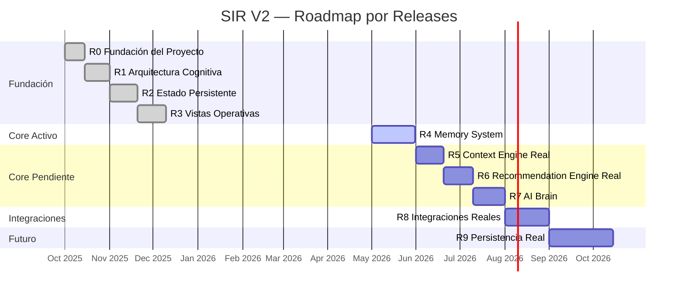

# MASTER_PLAN.md — SIR V2 Life OS

> **Objetivo raíz:** Conseguir Paz.
> Sistema operativo cognitivo-relacional privado. Segundo cerebro. Mission Control de vida.

---

## 1. Estado General

| Campo | Valor |
|-------|-------|
| Proyecto | SIR V2 — Life Operating System |
| Repositorio | `aaronhuaynate66/sir-v2-life-os` |
| Stack | Next.js 15 · TypeScript · Zustand · Tailwind CSS |
| Branch principal | `main` |
| Estado global | 🟡 EN PROGRESO — R5 Context Engine Real activo |
| Última actualización | 2026-05-24 |

---

## 2. Progreso General

```
Releases totales : 10 (R0 → R9)
Releases cerrados : 5  (R0, R1, R2, R3, R4)
Releases activos  : 1  (R5)
Releases pendientes: 3  (R6, R7, R8)
Releases futuros  : 1  (R9)

Progreso global   : ██████████░░░░░░░░░░  ~50%
```

---

## 3. Timeline Visual (Mermaid Gantt)



---

## 4. Estado por Release

| Release | Nombre | Estado | Descripción |
|---------|--------|--------|-------------|
| R0 | Fundación del Proyecto | ✅ Cerrado | Repo, estructura, docs base, CI |
| R1 | Arquitectura Cognitiva | ✅ Cerrado | Types, engines base, 12 engines skeleton |
| R2 | Estado Persistente | ✅ Cerrado | Zustand stores con persist, fixtures, CRUD |
| R3 | Vistas Operativas | ✅ Cerrado | /dashboard, /relationships, /goals, /finance, /signals, /memory read-only |
| R4 | Memory System | ✅ Cerrado | Memory store, engine, fixtures, context, captura automática |
| R5 | Context Engine Real | 🔄 Activo | ContextSnapshot real con todas las fuentes |
| R6 | Recommendation Engine Real | ⬜ Pendiente | Recomendaciones basadas en context real |
| R7 | AI Brain | ⬜ Pendiente | Integración OpenAI/Claude vía OpenRouter |
| R8 | Integraciones Reales | ⬜ Pendiente | Calendar, financiero, health, LinkedIn |
| R9 | Persistencia Real | 🔵 Futuro | Supabase + pgvector + auth real |

---

## 5. Progreso por Release

### R4 — Memory System (✅ Cerrado)

| Microtarea | Descripción | Estado |
|-----------|-------------|--------|
| R4A.1 | useMemoryStore — store Zustand persistente | ✅ Cerrado |
| R4A.2 | fixtureMemories — 5 memorias de ejemplo | ✅ Cerrado |
| R4A.3 | /memory solo lectura — vista con búsqueda y filtro | ✅ Cerrado |
| R4A.4 | buildMemoryContext — engine de análisis | ✅ Cerrado |
| R4A.5 | Memory Context en /memory — panel resumen en UI | ✅ Cerrado |
| R4B.1 | helpers createXMemory — factories tipadas por tipo | ✅ Cerrado |
| R4B.2 | Auto Memory Capture — /relationships → memoria | ✅ Cerrado |
| R4B.3 | Auto Memory Capture — /signals → memoria | ✅ Cerrado |
| R4B.4 | Auto Memory Capture — /self → memoria | ✅ Cerrado |
| R4B.5 | Auto Memory Capture — /finance → memoria | ✅ Cerrado |
| R4B.6 | Auto Memory Capture — /goals → memoria | ✅ Cerrado |

```
R4 Progress: ████████████████████  100%  (11/11 microtareas)
```

### Releases Previos Releases Previos (Cerrados)

```
R0 Progress: ████████████████████  100%
R1 Progress: ████████████████████  100%
R2 Progress: ████████████████████  100%
R3 Progress: ████████████████████  100%
```

---

## 6. Bloqueantes Actuales

| # | Bloqueante | Impacto | Acción requerida |
|---|-----------|---------|-----------------|
| B1 | R5 (Context Engine Real) no especificado | Bloquea R6 y R7 en cadena | Definir spec de ContextSnapshot real |
| B2 | Sin integración real de datos (R8) | Todo el sistema opera con fixtures | Planificar R8 cuando R7 esté cerrado || B3 | R5 (Context Engine Real) no especificado | Bloquea R6 y R7 en cadena | Definir spec de ContextSnapshot real |
| B4 | Sin integración real de datos (R8) | Todo el sistema opera con fixtures | Planificar R8 cuando R7 esté cerrado |

---

## 7. Issues Recomendados por Categoría

### Memoria (R4)
- `feat(memory): mostrar MemoryContext panel en /memory — R4A.5`
- `feat(memory): crear factory createEpisodicMemory, createEmotionalMemory — R4B.1`
- `feat(memory): Auto Memory Capture desde signals, goals, relationships — R4B.2`

### Context Engine (R5)
- `feat(context): implementar ContextSnapshot real desde todos los stores`
- `feat(context): conectar buildContextSnapshot con /dashboard`

### Recommendation Engine (R6)
- `feat(recommendation): recomendaciones basadas en ContextSnapshot real`
- `feat(recommendation): ranking por impacto en paz (peaceScore)`

### AI Brain (R7)
- `feat(ai-brain): system prompt con contexto completo del usuario`
- `feat(ai-brain): chat con SIR en panel lateral`
- `feat(ai-brain): análisis de patrones vía AI`

### UI / UX
- `feat(ui): responsive mobile para todas las vistas`
- `feat(dashboard): Mission Control con ContextSnapshot real`

### Infraestructura
- `chore: upgrade GitHub Actions de Node.js 20 a Node.js 22`
- `chore: configurar Vercel deploy automático en push a main`

---

## 8. ADRs Recomendados

| ADR | Título | Contexto |
|-----|--------|---------|
| ADR-001 | Zustand + persist como única capa de estado | Evitar Redux, no hay server state |
| ADR-002 | No backend hasta R9 | Mantener simplicidad, todo en localStorage |
| ADR-003 | TypeScript strict sin any | Calidad garantizada en CI |
| ADR-004 | Engines como funciones puras | Testables, sin efectos secundarios |
| ADR-005 | MemoryType como unión literal cerrada | Extensibilidad controlada |
| ADR-006 | OpenRouter como gateway de AI | Abstracción sobre OpenAI/Claude/Groq |
| ADR-007 | Supabase para persistencia real en R9 | pgvector nativo para memoria vectorial |

> Crear los ADRs en `docs/adr/` cuando corresponda implementar cada decisión.

---

## 9. Infraestructura

| Componente | Herramienta | Estado |
|-----------|-------------|--------|
| Framework | Next.js 15 + React 18 | ✅ Activo |
| Lenguaje | TypeScript (strict) | ✅ Activo |
| Estilos | Tailwind CSS | ✅ Activo |
| Estado | Zustand + persist | ✅ Activo |
| CI/CD | GitHub Actions (validate.yml) | ✅ Activo |
| Deploy | — (no configurado aún) | ⬜ Pendiente |
| Base de datos | — (R9) | 🔵 Futuro |
| Auth | — (R9) | 🔵 Futuro |
| AI Gateway | OpenRouter (R7) | ⬜ Pendiente |
| Memoria vectorial | pgvector / Supabase (R9) | 🔵 Futuro |

### CI Pipeline (validate.yml)
Cada push a `main` ejecuta los siguientes checks:
1. `npm run type-check` — TypeScript sin errores
2. `npm run lint` — ESLint sin errores
3. `npm run build` — Build de producción exitoso

---

## 10. Comandos de Validación

```bash
# Instalar dependencias
npm install

# Desarrollo local
npm run dev
# → http://localhost:3000/dashboard

# Validar antes de cada commit
npm run type-check   # TypeScript
npm run lint         # ESLint
npm run build        # Build completo

# Combinado (equivalente al CI)
npm run type-check && npm run lint && npm run build
```

---

## 11. Cómo Mantener Este Roadmap

1. **Al cerrar una microtarea:** Cambiar estado en la tabla de R4 (o el release activo) de `⬜ Pendiente` → `🟡 En progreso` → `✅ Cerrado`
2. **Al cerrar un release completo:** Cambiar estado en la tabla de Releases de `🟡 Activo` → `✅ Cerrado` y actualizar el siguiente release a `🟡 Activo`
3. **Al agregar microtareas nuevas:** Agregar fila en la tabla del release correspondiente y ajustar el porcentaje de progreso
4. **Al encontrar un bloqueante:** Agregar fila en la sección de Bloqueantes con impacto y acción requerida
5. **Al tomar una decisión técnica relevante:** Agregar fila en ADRs Recomendados y crear el archivo `docs/adr/ADR-XXX.md`
6. **Frecuencia de actualización:** Al finalizar cada microtarea o al inicio de cada sesión de trabajo

---

## 12. Siguiente Acción Inmediata

```
🎯 ACCIÓN: R5.1 — Definir ContextSnapshot real
```

**Qué hacer:**
- Definir estructura `ContextSnapshot` en `src/types`
- Implementar `buildContextSnapshot()` en `src/engines/context`
- Conectar todos los stores como fuentes: goals, relationships, signals, finance, self, memory
- Retornar snapshot tipado sin any

**Criterio de cierre de R5:**
- [ ] R5.1 ContextSnapshot definido y tipado
- [ ] buildContextSnapshot implementado y exportado
- [ ] CI verde en todas las microtareas

---

*Última actualización: 2026-05-24 · Maintainer: @aaronhuaynate66*
